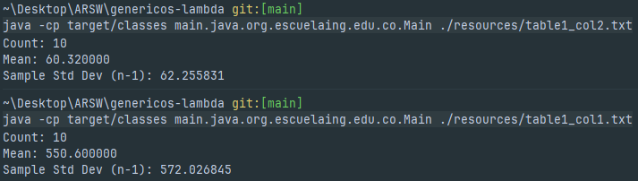

# Generics and Lambdas

### **Author:** Andrés Sepúlveda

## Project overview

This small Java project demonstrates two practical features of modern Java programming:

- **Generics:** writing a single linked-list implementation that works with any element type (```E```) while keeping compile-time type safety.

- **Lambdas:** using small anonymous functions (lambda expressions) to process list elements concisely via forEach.

The core of the project is a custom linked list ```MyLinkedList<E>``` (implemented to be compatible with Java Collections by extending ```AbstractList<E>```). The Main program reads real numbers from a text file into a ```MyLinkedList<Double>```, computes the mean and the sample standard deviation, and prints the results. The ```Main``` class also demonstrates using lambdas (```forEach```) to process the list.

## How to build and run (Maven)

**1.** Compile and package (from the project root):

```bash
mvn clean package
```

**2.** Run the program:

```bash
java -cp target/classes main.java.org.escuelaing.edu.co.Main ./resources/table1_col1.txt
```

## Input format

- The program accepts a path to a plain text file containing real numbers.

- Numbers can be whitespace-separated or one-per-line.

- The example test files (```table1_col1.txt``` and ```table1_col2.txt```) are included under ```src/main/resources/```.
  
## Expected example outputs

Using ```table1_col1.txt``` (10 integers):

**Count:** 10

**Mean:** 550.600000

**Sample Std Dev (n-1):** 572.026845


Using ```table1_col2.txt``` (10 doubles):

**Count:** 10

**Mean:** 60.320000

**Sample Std Dev (n-1):** 62.255831



## What the important files do

```MyLinkedList.java```

- A custom doubly-linked list that extends ```AbstractList<E>``` so it behaves like a standard List.

- Key operations are implemented:

  - ```add(E e)``` → uses ```linkLast(e)``` to append at the tail in O(1).

  - ```remove(int index)``` → uses ```unlink(node)``` to remove a node and reconnect neighbors.

  - ```get(int index)``` and a helper ```node(int index)``` that optimizes retrieval by starting from head or tail   depending on the index (it uses ```size >> 1``` to decide).

  - ```iterator()``` → returns an ```Iterator<E>``` that walks the list node by node, enabling ```for-each``` loops.

- ```modCount``` is updated on structural changes so iterators are fail-fast.

### Short explanations of important methods

- ```linkLast(E e)```
  
Appends a new node at the end:

```text
- Create new node with prev = oldTail, next = null
- tail = newNode
- if list was empty, head = newNode; otherwise oldTail.next = newNode
- size++ and modCount++
```

- ```unlink(Node<E> x)```
Removes a node ```x``` safely:

```text
- connect x.prev and x.next (or update head/tail if x was boundary)
- clear x's fields for GC
- size-- and modCount++
```

- ```node(int index)```
Returns the node at ```index``` by starting from ```head``` if index is in the first half, otherwise from ```tail```. This halves the traversal time on average.

- ```iterator()```
Provides sequential access over elements. This is what enables ```for (E e : myList)``` and ```myList.forEach(lambda)```.

```Main.java```

- Reads numbers from a file into ```MyLinkedList<Double>```.

- Computes:

  - Mean: sum of elements / n.

  - Sample standard deviation (n-1): ```sqrt(sum((xi - mean)^2) / (n - 1))```.

- Uses lambdas for iteration (e.g., ```list.forEach(d -> sum[0] += d);```). Because lambda variables must be effectively final, a single-element ```double[]``` is used as a mutable container for accumulation.


## Testing

- Two sample datasets (the two columns from Table 1) are included as ```table1_col1.txt``` and ```table1_col2.txt```.

- Run the program for each input and compare the printed results with the expected outputs above.


## Notes and limitations

- ```MyLinkedList``` is not thread-safe. If you use it from multiple threads concurrently, synchronization is required.

- The program computes sample standard deviation (uses n-1), which fits typical statistical practice for sample estimates. Change to population standard deviation if required (```n``` in the denominator).

- The lambda-based accumulation uses a mutable array as a small workaround because lambda bodies cannot mutate non-final local variables directly.

